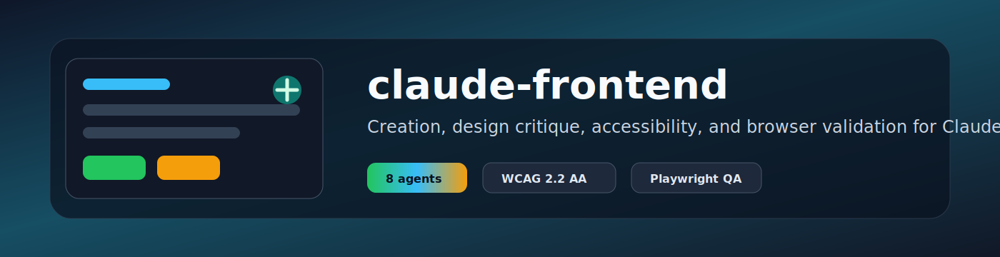
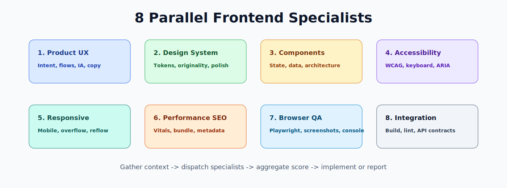
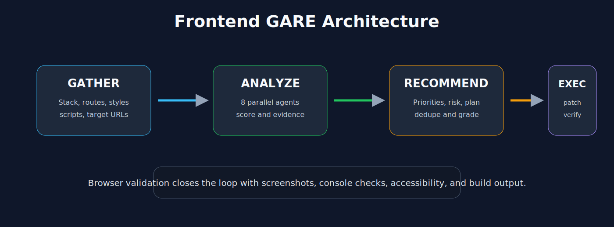
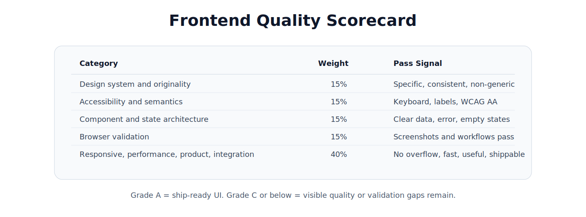

<p align="center">
  
</p>

<p align="center">
  
  
  
  
  
</p>

---

**AI-powered frontend creation, design critique, and browser validation for Claude Code.**

`claude-frontend` packages a frontend specialist workflow as a Claude Code skill. It mirrors
the architecture of `claude-cybersecurity`: gather project context, dispatch parallel
specialist agents, aggregate findings with weighted scoring, then produce an actionable
report or implementation plan.

The skill is built around frontend work that needs more than code generation:

- product fit and information architecture
- visual direction and design-system consistency
- React, Next.js, Vue, Svelte, Angular, and general component patterns
- accessibility against WCAG 2.2 AA
- responsive layout and overflow checks
- performance budgets and Core Web Vitals
- API/state contracts, loading, empty, error, and optimistic states
- Playwright/browser validation across desktop and mobile viewports

## Installation

### Manual

```bash
git clone https://github.com/AgriciDaniel/claude-frontend.git
cd claude-frontend
bash install.sh
```

### Local Development Install

```bash
bash install.sh --local
```

The local mode copies from the checked-out repo instead of cloning from GitHub.

## Quick Start

```bash
# Build or improve a frontend from the current project context
/frontend "Create a polished pricing page with yearly/monthly billing"

# Audit an existing application without changing code
/frontend --mode audit --target http://localhost:3000

# Validate a completed UI with browser screenshots and checks
/frontend --mode validate --target http://localhost:3000

# Review only changed frontend files
/frontend --mode diff

# Deep focus on one dimension
/frontend --focus a11y
```

## What It Does

<p align="center">
  
</p>

## Architecture

<p align="center">
  
</p>

## Scorecard

<p align="center">
  
</p>

## File Structure

```text
skills/frontend/
├── SKILL.md
└── references/
    ├── accessibility-wcag.md
    ├── browser-validation.md
    ├── design-system-audit.md
    ├── frontend-quality-rubric.md
    ├── performance-budget.md
    ├── report-template.md
    ├── responsive-layout.md
    ├── state-api-contracts.md
    ├── frameworks/
    │   ├── react-next.md
    │   └── vue-svelte-angular.md
    └── validation-recipes/
        ├── playwright.md
        └── visual-regression.md
```

## Requirements

- Claude Code with skill support
- Node.js project tooling for build/lint/test validation when available
- Playwright is optional but strongly recommended for browser validation

## Uninstall

```bash
bash uninstall.sh
```

Or manually:

```bash
rm -rf ~/.claude/skills/frontend
```

## Missing Before Public Release

See [RECOMMENDATIONS.md](RECOMMENDATIONS.md). The main gaps are marketplace publishing,
real-world benchmark examples, and optional automation scripts for screenshot diffing.

## License

[MIT](LICENSE)
